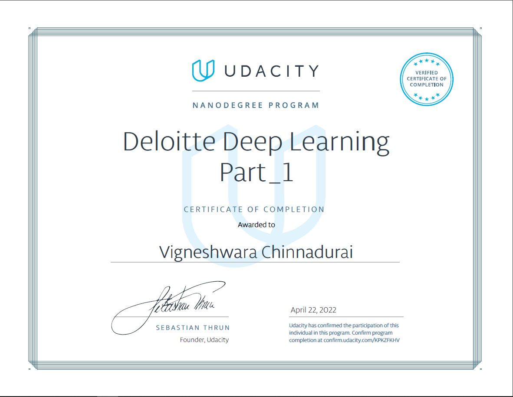
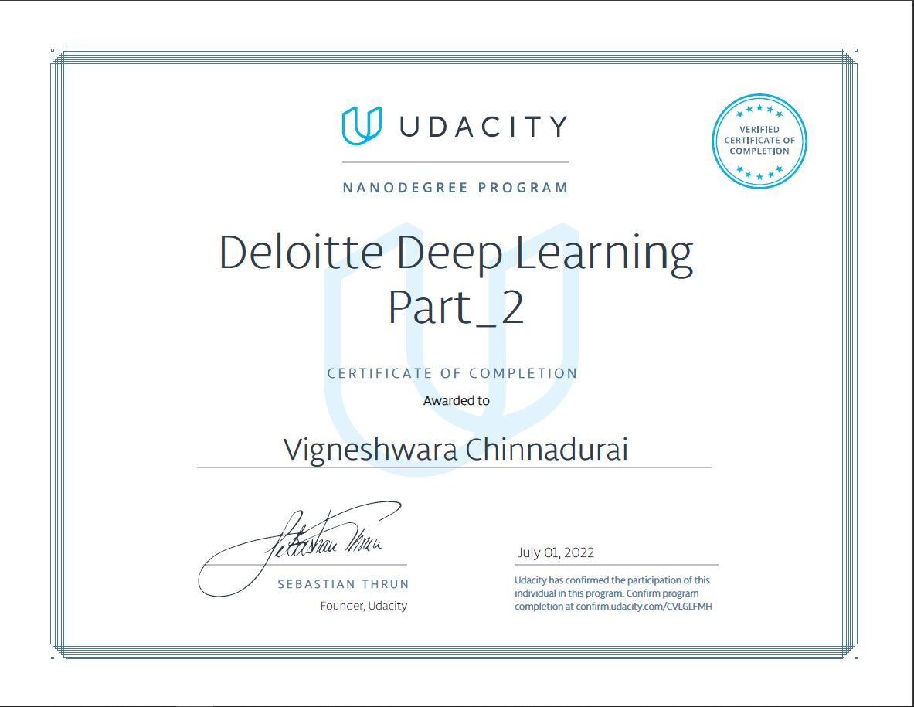

    
	
    <h1>Udacity Deep Learning Nanodegree</h1>
    
N.B.: Please don't use the assignment and quiz solution. Try to solve the problem by yourself.
 
	
N.B.: Check my review about the course [here](https://www.linkedin.com/posts/vigneshwarac_nanodegree-deloitte-milestoneachieved-activity-6924422307369148417-McM8?utm_source=linkedin_share&utm_medium=member_desktop_web)
 
    
Become an expert in neural networks, and learn to implement them using the deep learning framework PyTorch. Build convolutional networks for image recognition, recurrent networks for sequence generation, generative adversarial networks for image generation, and learn how to deploy models accessible from a website. - <a href="https://www.udacity.com/course/deep-learning-nanodegree--nd101">Source</a>

	

Markdown cheat sheet: https://github.com/adam-p/markdown-here/wiki/Markdown-Cheatsheet